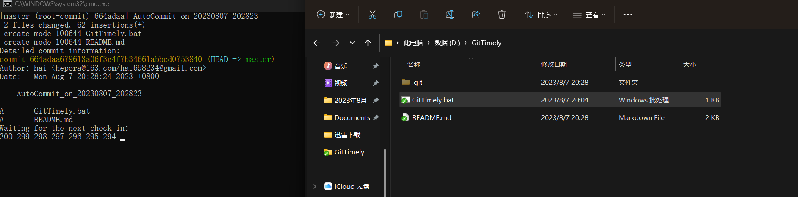

### Windows .bat git auto

这是一个简易的Windows端批处理程序，主要用于定期的自动检测文件是否修改，并自动对修改的文件进行git提交，可用于文件的版本管理。

### 使用方法

1. 创建一个文件夹，并在该文件夹中初始化一个git版本库。
2. 将该.bat文件拖放到创建的文件夹中。
3. 双击运行该.bat文件。
4. 只要程序窗口保持打开状态，将会每隔5分钟自动检测文件是否修改。
5. 如果关闭窗口，则停止程序运行。

### Windows .bat git auto

This is a simple Windows batch program mainly used for periodic automatic detection of file modifications and automatically performing git commits on the modified files. It can be used for version management of files.

###  Instructions:

1. Create a folder and initialize a git repository within that folder.
2. Drag and drop the .bat file into the created folder.
3. Double-click the .bat file to run it.
4. As long as the program window is open, it will automatically check for modifications every 5 minutes.
5. If you close the window, the program will stop running.

### 示例截图(Example Screenshot):

